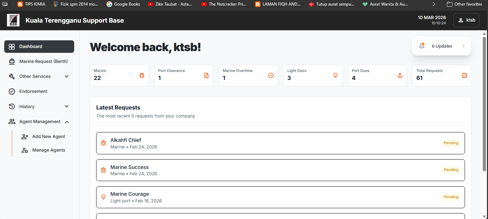
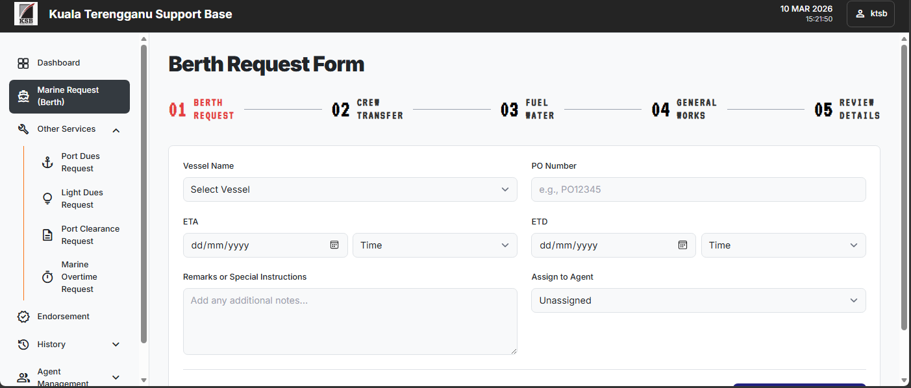
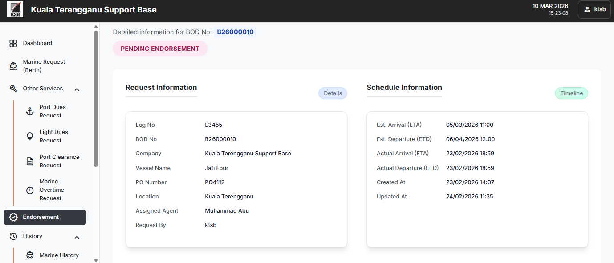

Kuala Terengganu Support Base (KTSB) System

Overview

The Kuala Terengganu Support Base (KTSB) System is a web-based operational management module developed as part of the Integrated Logistics Management System (ILMS).

The system is designed to support logistics and marine operational processes at the Kuala Terengganu Support Base by digitalizing key request and management procedures. It helps streamline operational workflows, improve data tracking, and reduce manual administrative tasks.

Through this platform, authorized personnel can submit operational requests, manage marine-related activities, and monitor logistics operations within the support base.

System Functions:

-Marine Berth request (sign on / sign off)

-Port & light dues request

-Port clearance & marine overtime

These functions assist operational teams in managing marine logistics activities more efficiently within the support base environment.

Key Features

User Module

-Submit marine operation requests

-Track request status

-View operational records

Admin Module

-Manage and approve operational requests

-Monitor marine logistics activities

-Maintain operational records and data

Technologies Used

Component	Technology

Frontend :	HTML, CSS, JavaScript

Backend :	PHP

Database :	MySQL

Installation Guide

1. Clone the Repository
   
3. git clone https://github.com/ZersssR/ktsb-system.git

4. Move Project to Local Server
   

Place the project folder inside your local server directory.

Example:

XAMPP

htdocs/ktsb-system

Laragon

www/ktsb-system

3. Import Database

Open phpMyAdmin

Create a new database (example: ktsb_system)

Import the provided SQL file

4. Run the System

Start your local server and open:

http://localhost/ktsb-system

Project Purpose

-This system was developed during industrial training as part of operational system development within the logistics management environment.

Future Improvements

-Improve system security and authentication

-Add advanced reporting and analytics

-Enhance user interface and usability

-Implement responsive design for mobile access

Screenshots

Author

Syu
Bachelor of Computer Science (Software Development)
